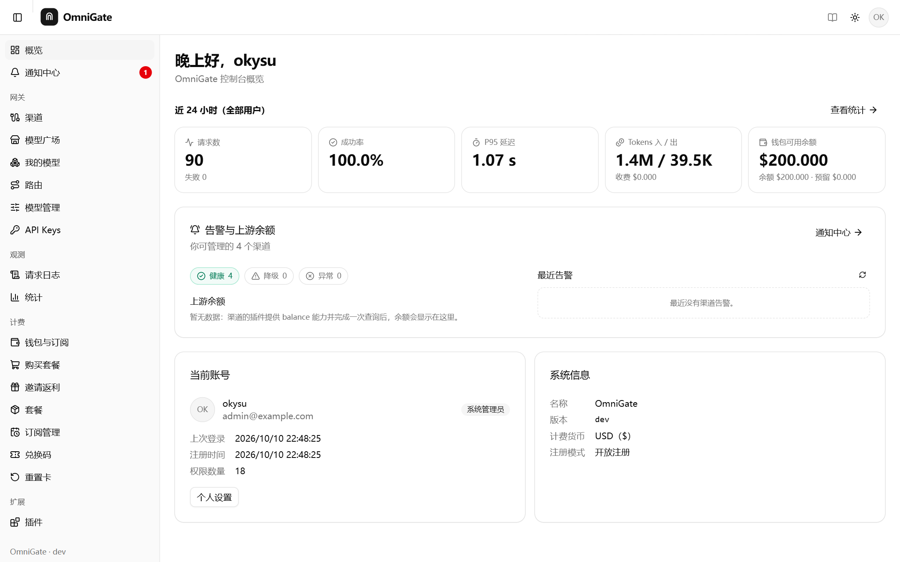
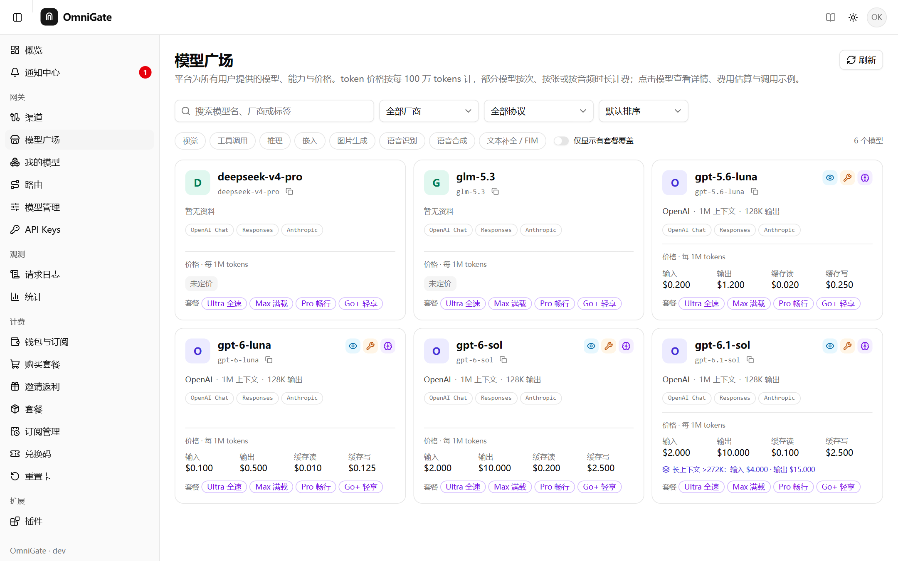
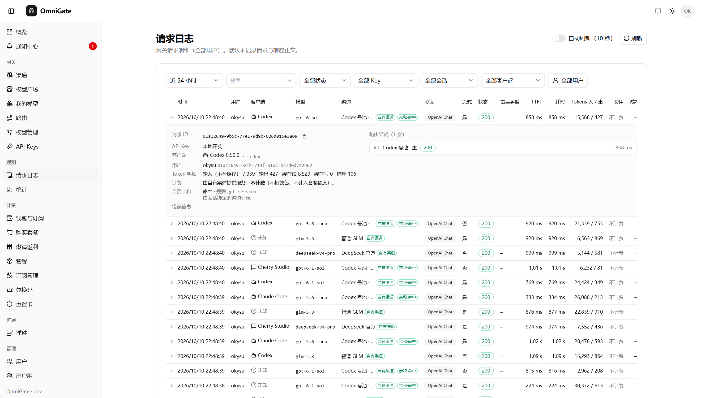
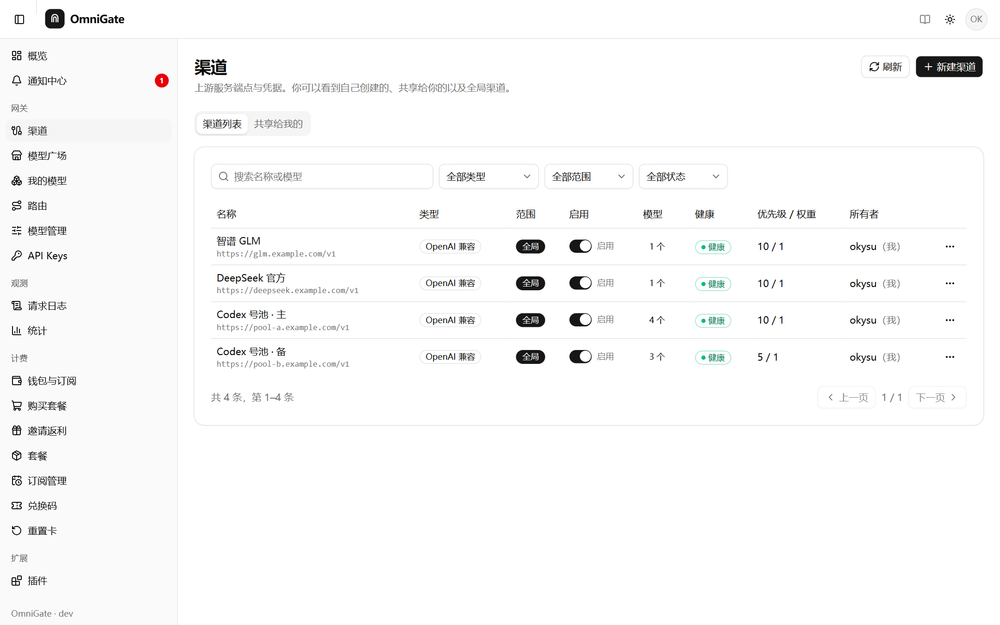
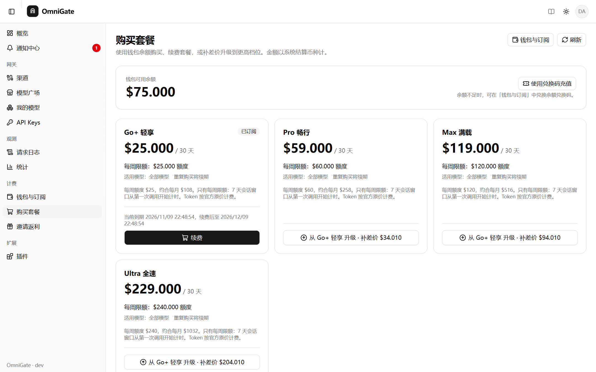
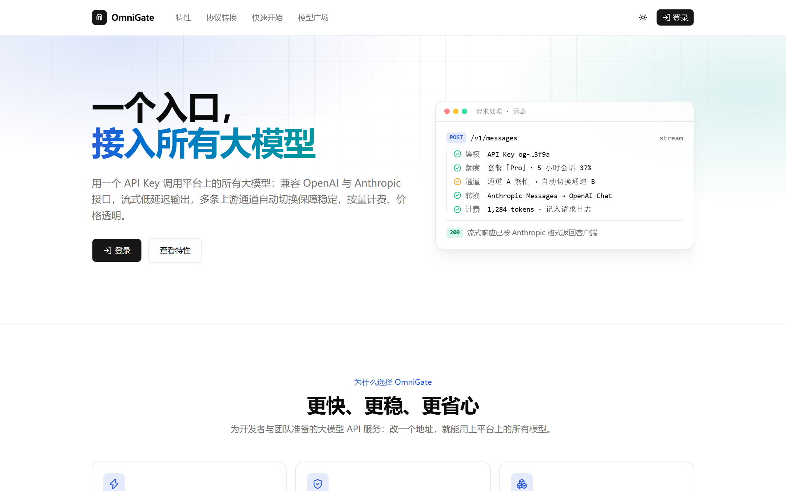
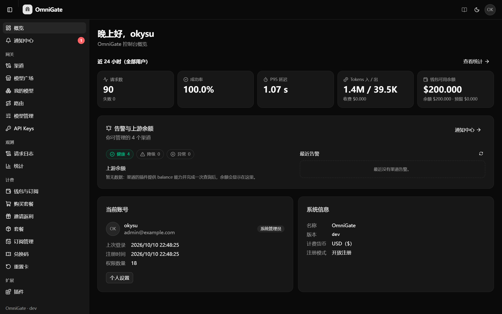

<div align="center">

# OmniGate

**可自托管的统一大模型 API 网关 —— 一个 Key，接入平台上的全部模型。**

OpenAI 与 Anthropic 协议互转 · 多渠道路由与故障转移 · 插件化渠道 · 钱包、套餐与计费 · 多用户与审计

[](https://github.com/Okysu/OmniGate/actions/workflows/release.yml)


[](LICENSE)

[快速开始](#快速开始) · [功能特性](#功能特性) · [截图](#截图) · [接入方式](#接入方式) · [文档](#文档) · [本地开发](#本地开发)



</div>

## 简介

OmniGate 是一个面向个人与团队的大模型 API 网关。把 OpenAI、Anthropic、DeepSeek、智谱等上游接入为「渠道」后，用户只需要一个 `og-` 开头的 API Key，
就能用 OpenAI 或 Anthropic 协议的 SDK 与客户端（OpenAI SDK、Anthropic SDK、Claude Code、Codex、Cherry Studio……）调用平台上的模型，
网关负责协议转换、路由、重试、计费与审计。跨协议调用时的能力边界见 [协议转换说明](#协议转换说明)。

- **一个镜像、一个端口**：后端与管理后台编译为单个二进制，同一端口提供页面、`/api` 与 `/v1`。
- **零依赖起步**：默认使用嵌入式 SQLite，数据就是一个文件；需要时切换到 PostgreSQL。
- **渠道即代码（Channel as Code）**：每个厂商渠道都可以是一个可版本化、可审计的 TypeScript 插件。

## 功能特性

**协议与接口**

- OpenAI Chat Completions、Responses（含 WebSocket 模式）与 Anthropic Messages 三种入口，任意入口可路由到任意协议的渠道，请求与流式响应自动互转（[能力边界](#协议转换说明)）
- 嵌入、图片生成 / 编辑、语音转写 / 合成、文本补全（Completions / FIM）
- 识别 Claude Code、Codex、Cherry Studio 等客户端，按会话亲和把同一段对话固定到同一渠道，提高上游提示词缓存命中率

**路由与可靠性**

- 按优先级、协议匹配度、权重与延迟选择渠道；失败自动重试与回退，路由规则支持按模型改写与回退模型
- 渠道熔断与后台主动探测恢复；上游 401 / 403 告警；用户自带渠道优先且不计费，可共享给其他用户或用户组

**插件化渠道**

- TypeScript 插件在沙盒中运行：请求改写与签名 Hook、余额 / 模型 / 健康 / 用量等原子能力、自定义协议、计费插件
- 在线编辑器、版本管理与审批，静态扫描插件声明的权限

**计费与运营**

- 预付费钱包、兑换码、按模型售价计费（分时价格、按上下文长度的阶梯价格、用户组倍率）、每日 / 每月消费限额
- 套餐与周期配额（会话窗口、日历窗口、滚动窗口等），用户可用余额购买、续费、补差价升级；额度重置卡
- 邀请返利、注册赠送、模型广场、站内 / 邮件 / Webhook 通知

**多用户与安全**

- GitHub 与任意 OIDC 登录，系统管理员 / 渠道管理员 / 用户 / 审计员四种角色，注册模式与邮箱域名白名单
- 上游凭据用主密钥加密存储，完整的审计日志，请求日志默认不记录正文

## 截图

| | |
|:---:|:---:|
| <br>**模型广场**：能力、价格、可用协议与覆盖的套餐 | <br>**请求日志**：客户端、渠道、TTFT、Token 与缓存明细、路由尝试 |
| <br>**渠道管理**：优先级、权重、健康状态 | <br>**购买套餐**：余额购买、续费与补差价升级 |
| <br>**落地页**：可选的对外首页 | <br>**深色模式** |

## 快速开始

镜像发布在 `ghcr.io/okysu/omnigate`（linux/amd64、linux/arm64）。登录需要一个 GitHub OAuth App（或任意 OIDC 提供方），
回调地址为 `<你的地址>/api/auth/github/callback`。

### 用 Docker 试用

```bash
# 1. 生成主密钥（用于加密上游凭据）
docker run --rm ghcr.io/okysu/omnigate:latest keygen

# 2. 查询你的 GitHub 数字 ID，作为第一个管理员
curl -s https://api.github.com/users/<你的 GitHub 用户名> | grep '"id"'

# 3. 启动（数据保存在 omnigate-data 卷中的 SQLite 文件）
docker run -d --name omnigate -p 127.0.0.1:8080:8080 -v omnigate-data:/data --stop-timeout 40 \
  -e OMNIGATE_MASTER_KEY='<keygen 输出的整行>' \
  -e OMNIGATE_AUTH_GITHUB_CLIENT_ID=<Client ID> -e OMNIGATE_AUTH_GITHUB_CLIENT_SECRET=<Client Secret> \
  -e OMNIGATE_BOOTSTRAP_ADMINS=github-id:<数字 ID> \
  -e OMNIGATE_SEED_ON_START=builtin \
  ghcr.io/okysu/omnigate:latest
```

打开 http://localhost:8080 登录后，在「渠道」中添加上游，在「API Keys」中创建 Key 即可使用。

- `OMNIGATE_SEED_ON_START=builtin` 会在首次启动时导入一份示例价格、模型资料与套餐目录，可随时在后台修改（见 [deploy/seed/README.md](deploy/seed/README.md)）。
- 引导管理员请使用不可变的 `github-id:<数字 ID>`，不要用用户名。
- 在线备份：`docker exec omnigate omnigate backup /data/backups/omnigate-$(date +%Y%m%d-%H%M%S).db`。

### 生产部署

[`deploy/`](deploy) 目录提供 Docker Compose 编排：OmniGate 本身，加上可选的 PostgreSQL 与 Caddy（自动 HTTPS）profile。

```bash
cd deploy
cp .env.example .env                                   # Compose 变量：镜像标签、启用的 profile、域名
install -m 600 omnigate.env.example omnigate.env       # OmniGate 变量：数据库、主密钥、登录方式、管理员……
docker compose --profile caddy up -d                   # OmniGate + Caddy（SQLite 或外部 PostgreSQL）
docker compose --profile postgres --profile caddy up -d   # 再加一个捆绑的 PostgreSQL
```

完整步骤（域名与 HTTPS、反向代理、备份与恢复、升级）见 [部署手册](docs/operations/deploy-production.md)，
全部环境变量见 [配置参考](docs/operations/configuration.md)，SQLite 与 PostgreSQL 的取舍见 [部署说明](docs/operations/deployment.md)。

## 接入方式

在后台创建 API Key（`og-` 开头）后：

```bash
# OpenAI SDK 与兼容客户端
export OPENAI_BASE_URL=https://your-gateway.example.com/v1
export OPENAI_API_KEY=og-...

# Anthropic SDK / Claude Code
export ANTHROPIC_BASE_URL=https://your-gateway.example.com
export ANTHROPIC_AUTH_TOKEN=og-...
```

同一个 Key 可以通过任一协议访问任意渠道的模型。例如 Claude Code 可以直接调用 OpenAI 兼容渠道上的模型，网关自动完成 Messages ⇄ Chat 的转换。

## 协议转换说明

客户端协议与渠道协议**相同**时，请求与响应原样透传（只替换模型名），所有字段与能力都可用。**不同**时由网关转换：以 Chat Completions
为中间格式，Messages ⇄ Responses 经过两次转换。路由会优先选择与客户端协议相同的渠道，以减少转换。

**完整转换**（有测试覆盖）：

- 文本、多轮对话、system / developer 指令；图片输入（URL 与 base64）
- 函数工具：工具定义、`tool_choice`、并行调用、流式工具调用参数、工具结果（Anthropic 工具结果中的图片会放进紧随其后的用户消息）
- 流式响应（SSE 事件逐个转换）、停止原因、Token 用量（含缓存读写与推理 Token）
- 结构化输出：`response_format` json_schema ⇄ Anthropic `output_config.format` ⇄ Responses `text.format`
- 推理强度：`reasoning_effort` ⇄ `thinking` / `output_config.effort`
- 采样参数：`max_tokens`、`temperature`、`top_p`；`prompt_cache_key` 等提示字段尽量保留

**会丢弃或无法转换**（丢弃的字段会在响应头 `X-OmniGate-Compat-Warnings` 中列出）：

| 内容 | 转换时的处理 |
|---|---|
| 推理 / 思考内容（`thinking`、`reasoning` 输入项、`reasoning_content`） | 丢弃：各家的推理内容不能互相传递（加密签名不通用），模型会重新推理 |
| Anthropic `cache_control` | 丢弃：上游按自己的规则自动缓存 |
| 服务端工具（联网搜索、代码解释器、文件检索等）与非函数类型的工具 | 不支持；只有函数工具可以转换 |
| HTTP 请求中的 `previous_response_id` | 需要转换协议时不支持（依赖上游保存的会话），请发送完整的 `input`；**WebSocket 模式**下网关会在连接内缓存历史并自动展开，可以正常接续 |
| `stop` 发往 Responses 渠道 | Responses API 没有该参数，带警告丢弃 |
| `n > 1`、`logprobs`、Responses `input_image.file_id` 等少数字段 | 不支持 |

API Key 的兼容模式决定遇到**无法转换**的字段时的行为：`strict`（默认）返回 `400 unsupported_parameter` 并列出字段，
`lenient` 丢弃这些字段并继续。需要上述能力的客户端，请让它的请求落在同协议的渠道上（例如 Responses 客户端配 Responses 渠道），
可以用路由规则或 Key 的可用渠道限制来保证。完整的字段对照见 [protocol-adapter.md](docs/contracts/protocol-adapter.md)。

## 文档

| 文档 | 内容 |
|---|---|
| [docs/README.md](docs/README.md) | 文档索引 |
| [docs/architecture.md](docs/architecture.md) | 架构总览 |
| [docs/operations/configuration.md](docs/operations/configuration.md) | 环境变量、渠道、路由、计费、套餐、插件等全部配置 |
| [docs/operations/deploy-production.md](docs/operations/deploy-production.md) | 生产部署手册 |
| [docs/contracts/](docs/contracts) | HTTP 接口契约与 [OpenAPI](docs/contracts/openapi.yaml) |
| [docs/adr/](docs/adr) | 架构决策记录：插件引擎、租户与权限、计费与配额、SQLite 轻量模式等 |
| [docs/threat-model.md](docs/threat-model.md) | 威胁模型 |

## 本地开发

需要 Go 1.26+、Node 24+、pnpm 与 Docker。

```bash
make dev-deps      # 启动 PostgreSQL 与本地模拟 OIDC（http://localhost:9000）
make dev-server    # 后端 :8080
make dev-web       # 前端 http://localhost:5173（选择“本地模拟 OIDC”，用户名填 admin 即为管理员）
make test          # 单元 + 集成测试（PostgreSQL 与 SQLite 各跑一遍）
make lint          # gofmt / go vet / staticcheck / eslint / vue-tsc
make build         # 生成嵌入前端的单二进制 bin/omnigate
make docker        # 构建镜像 omnigate:dev
```

项目结构：

```
server/     Go 后端（模块化单体，入口 cmd/omnigate）
web/        Vue 3 + TypeScript + shadcn-vue 管理后台
deploy/     Docker Compose、环境变量模板、Caddy / nginx 配置、示例目录
docs/       架构、接口契约、ADR、运维文档
scripts/    初始化脚本
```

每次 push 与 Pull Request 都会运行完整 CI：Go 静态检查与漏洞扫描、在 PostgreSQL 与 SQLite 上的 `-race` 集成测试、前端 lint / 类型检查 / 测试 / 构建，
全部通过后才构建并发布多架构镜像。

## 参与贡献

欢迎提交 Issue 与 Pull Request。提交前请在本地运行与 CI 相同的检查：

```bash
make lint vulncheck test
cd web && pnpm lint && pnpm typecheck && pnpm test && pnpm build
```

涉及接口或数据模型的改动，请同步更新 [docs/contracts](docs/contracts) 中的契约与迁移（`server/migrations` 下 PostgreSQL 与 SQLite 各一份）。

## 许可证

[MIT](LICENSE) © Okysu
