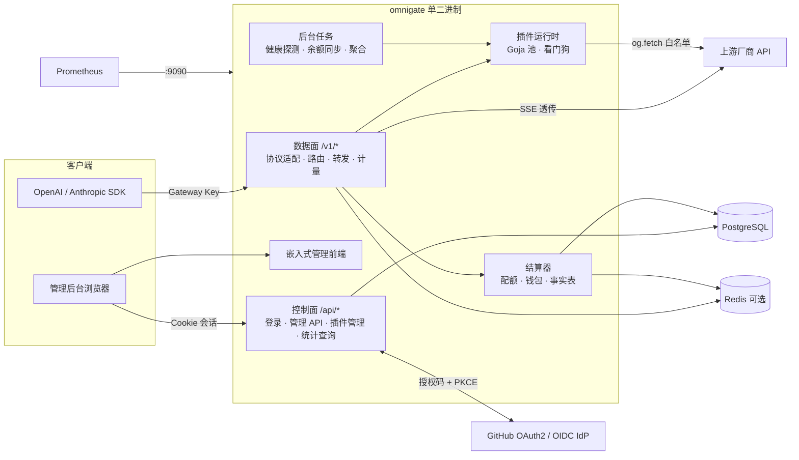

# OmniGate 系统架构

> 版本：Round 3（Phase 2 插件系统）。决策依据见 [ADR](adr/README.md)；接口契约见 [contracts/](contracts/)。

## 1. 总览



## 2. 进程内模块（`server/internal`）

| 模块 | 职责 | 状态 |
| --- | --- | --- |
| `app` | 装配依赖、两棵路由树、优雅关闭、结算币种初始化 | ✅ |
| `config` | 环境变量加载与校验（生产环境安全默认值） | ✅ |
| `platform/db` | pgx 连接池、goose 迁移（advisory lock）、事务辅助 | ✅ |
| `platform/httpx` | 请求 ID、客户端 IP（可信代理）、访问日志、统一错误、分页 | ✅ |
| `platform/secretbox` | AES-256-GCM + HKDF 子密钥 + AAD 绑定 + 轮换 | ✅ |
| `apperr` | 与传输层无关的错误类型 | ✅ |
| `money` | 定点金额（nano int64） | ✅ |
| `identity` | 用户、外部身份、会话存储 | ✅ |
| `auth` | GitHub OAuth2 适配器、通用 OIDC、登录准入、会话中间件、CSRF、登录限流 | ✅ |
| `authz` | 角色 → 权限表、`role + action + resource + scope` 判断 | ✅ |
| `audit` | 只追加审计日志 | ✅ |
| `adminapi` | `/api/admin/users`、`/api/admin/audit-logs` | ✅ |
| `gateway` | 数据面：Key 认证与策略、路由与回退、协议转换、流式转发、计量、预留与结算 | ✅ |
| `protocol` | SSE、usage 归一化、错误信封、Chat ↔ Messages 转换（含流式、工具、思考） | ✅ |
| `channel` | 渠道 CRUD、加密凭据、可见性、熔断器、数据面快照、测试与模型发现 | ✅ |
| `keys` | Gateway Key（SHA-256 存储、策略、吊销/轮换、认证缓存、RPM） | ✅ |
| `pricing` | 版本化成本价/售价、计价、模型目录 | ✅ |
| `requestlog` | 异步批量写入（COPY）、按月分区、日志查询、统计汇总 | ✅ |
| `billing` | 钱包、只追加账本、余额预留/结算、兑换码、计费设置 | ✅ |
| `platform/netguard` | 防 SSRF 的上游 HTTP 客户端（拨号时校验解析后的 IP） | ✅ |
| `webui` | 嵌入 `web/dist`，SPA 回退，安全响应头（CSP 等） | ✅ |
| `plugin` | manifest v1 校验、esbuild 编译、风险扫描、草稿/发布/审批、ZIP 导入导出、内置与随附插件、能力调用与结果、请求 Hook、配置迁移、插件存储 | ✅ |
| `plugin/engine` | Goja 运行时池、超时/取消中断、进程堆看门狗、宿主 API（`og.fetch`/`secret`/`crypto`/`storage`/`log`）、模拟 fetch | ✅ |
| 套餐与周期配额（`billing` 扩展） | 计量 × 窗口 × 上限、订阅 | Phase 3 |

## 3. 数据面请求流水线（Phase 1 起）

```
入口协议 Decode
 → Gateway Key 认证（SHA-256 摘要查找；拒绝已停用用户的 Key）
 → Key 策略（模型/协议/渠道/IP/功能开关）
 → 模型映射（逻辑模型 → 候选渠道模型）
 → 渠道可见性（private / shared / global）
 → 健康状态（熔断器）
 → 限额与并发（RPM/TPM/并发/预算/订阅配额/钱包预留）
 → 路由算法（固定 / 优先级 / 加权 / 延迟 / 成本）
 → 插件请求 Hook（仅当渠道插件声明 transformRequest / signRequest；50ms）
 → 上游请求（内置协议原生 Go）
 → 响应：逐事件 Flush，绝不整包缓冲；旁路解析 usage
 → 请求结束事件 → 结算器（异步、幂等）
```

失败语义见 [contracts/protocol-adapter.md](contracts/protocol-adapter.md)；计费见 [contracts/billing-and-quota.md](contracts/billing-and-quota.md)。

## 4. 控制面

- 认证：Cookie 会话（ADR-0005）；CSRF：`X-Requested-With` + Origin 校验；CORS 默认关闭。
- 授权：每个路由显式声明所需权限（`auth.Require(perm)`），资源级判断在服务层。
- 写操作：高风险写操作带 `version` 乐观锁（例如 `PATCH /api/admin/users/{id}`），冲突返回 409 `version_conflict`。
- 列表：统一 `?page=&pageSize=&sort=` 与 `{items,total,page,pageSize}`。
- OpenAPI：[contracts/openapi.yaml](contracts/openapi.yaml)。

## 5. 降级行为

| 故障 | 行为 |
| --- | --- |
| PostgreSQL 不可用 | `/readyz` 返回 503；控制面写操作失败；数据面在 Phase 1 使用短时缓存的 Key/路由配置继续服务，用量事实写入本地缓冲并在恢复后补写（缓冲有上限，超过上限后拒绝新请求，防止漏记） |
| Redis 不可用 | 退化为进程内限流与计数（单实例语义），记录告警 |
| 插件执行器崩溃/超时 | 单次 Hook 失败 → 该请求返回 `upstream_invalid_response` 或触发回退；连续失败 → 熔断该插件版本 |
| 单渠道故障 | 被动健康检查 → 降级/熔断 → 回退到同模型的其他渠道 |
| IdP 不可用 | 已登录会话不受影响；新登录失败并显示 `oauth_failed` |

## 6. 部署形态

- **单机**（当前唯一支持的形态）：`deploy/docker-compose.yml` 只运行 omnigate 一个容器，数据库为内嵌 SQLite 或外部 PostgreSQL，见 [deploy-production.md](operations/deploy-production.md)。指标端口只在 compose 内网暴露。
- **反向代理**：TLS 终止；`/v1` 必须关闭代理缓冲（nginx `proxy_buffering off;`）以保证 SSE 低延迟；
  配置 `OMNIGATE_TRUSTED_PROXIES` 以正确解析客户端 IP。
- **水平扩展**（Phase 4）：多实例共享 PostgreSQL + Redis；限流、配额、熔断状态全部放在 Redis。

## 7. 前端（`web/`）

Vue 3 + TS（strict）+ Vite + Tailwind v4 + shadcn-vue（reka-ui）+ Pinia + vue-router。
所有尚未接通后端的页面使用 `PlaceholderPage`，明确标注“占位 · Phase N”，不使用伪造数据。
导航配置集中在 `web/src/config/nav.ts`，权限名与后端 `authz` 常量一致。
