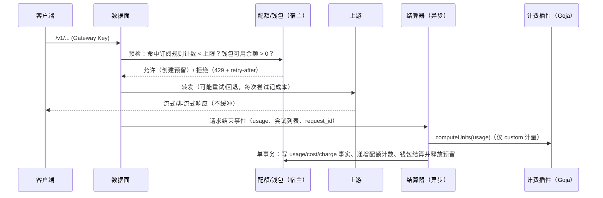

# 契约草案：计费、配额、钱包与兑换码

> 状态：**草案**（对应 ADR-0006，提议中）。本文件先固定数据结构与失败语义，实现计划在 Phase 3（周期配额、兑换码可提前到 Phase 1 末）。
> 金额一律为十进制字符串，单位为结算币种（见 ADR-0007）。

## 1. 名词

| 名词 | 含义 |
| --- | --- |
| 结算币种 | 部署级唯一币种，`/api/system/info` 返回 `{code,symbol,decimals}` |
| 成本价 / 售价 | 上游渠道模型的成本价；对下游逻辑模型的售价。两者都按版本保存，带生效时间 |
| 计量 meter | 被计数的量，见 §2 |
| 配额规则 QuotaRule | 计量 × 窗口 × 上限 × 范围 × 超额行为 |
| 套餐 Plan | 一组配额规则 + 模型范围 + 周期/有效期 |
| 订阅 Subscription | 用户持有的套餐实例，**快照**套餐规则 |
| 钱包 Wallet | 按量付费余额（API 积分），账本只追加 |
| 发放 Grant | 兑换码、管理员调整、未来的在线支付统一走“发放”：增加钱包余额或创建/续期订阅 |

## 2. 计量（meter）

```ts
type Meter =
  | 'requests'
  | 'tokens.input' | 'tokens.output' | 'tokens.cache_read' | 'tokens.cache_write'
  | 'tokens.reasoning' | 'tokens.total'
  | 'charge'              // 按售价折算的金额（结算币种）
  | `custom:${string}`    // 计费插件声明，例如 custom:weighted
```

`custom:*` 由计费插件的 `computeUnits(usage, ctx)` 计算（请求结束后执行，见 §8），结果为非负整数或十进制字符串。

## 3. 窗口（window）

```ts
type Window =
  | { kind: 'calendar'; unit: 'day' | 'week' | 'month'; timezone: string; weekStart?: 1 | 7 } // 1=周一
  | { kind: 'rolling';  duration: string; bucket?: string }   // 例："5h"，bucket 默认 "5m"
  | { kind: 'session';  duration: string }                    // 首次使用起算，例："5h"
  | { kind: 'period';   every: string }                        // 与订阅起点对齐，例："1mo"
  | { kind: 'lifetime' }
```

| 窗口 | 何时重置 | `retry-after` 计算 |
| --- | --- | --- |
| calendar | 时区内自然日/周/月边界 | 距下一个边界 |
| rolling | 连续滑动；按桶过期 | 最早一个“使累计降到上限以下”的桶过期时刻 |
| session | 窗口开始后 duration；窗口过期后的第一次请求开启新窗口 | 当前窗口结束时刻 |
| period | 订阅起点 + n × every | 下一个周期起点 |
| lifetime | 不重置 | 无（返回 `quota_exhausted`） |

## 4. 配额规则与套餐

```ts
interface QuotaRule {
  id: string                 // 套餐内唯一，例 "5h"、"weekly"
  meter: Meter
  window: Window
  limit: string              // 十进制；requests/tokens 为整数
  scope: 'subscription' | 'user' | 'key'
  models?: string[]          // 逻辑模型或模型组；空 = 套餐覆盖的全部模型
  onExceed: 'block' | 'overflow_to_wallet'
}

interface Plan {
  id: string
  name: string
  description?: string
  listPrice?: string         // 展示用标价（兑换码面值参考）；首期不对接支付
  duration: string           // 单次购买的有效期，例 "30d"
  models: string[]           // 覆盖的逻辑模型/模型组
  rules: QuotaRule[]
  stackable: boolean         // 同一用户能否同时持有多份
  status: 'active' | 'archived'
  version: number            // 乐观锁
  templateRef?: { pluginId: string; version: string; template: string }
}
```

**多份订阅/多条规则的判定**：一个请求命中的所有订阅里，只要有一份订阅的**全部规则**都未超额，就从这份订阅扣（按到期时间最早优先）；
都不可用时：若有规则配置了 `overflow_to_wallet` 且钱包余额充足，就转为钱包按量；否则阻断。

## 5. 钱包与账本

```ts
interface Wallet { userId: string; balance: string; reserved: string; available: string; currency: string; version: number }

interface LedgerEntry {
  id: string
  walletId: string
  kind: 'grant' | 'charge' | 'refund' | 'adjust' | 'reserve' | 'release'
  amount: string             // 正数入账，负数出账
  balanceAfter: string
  ref: { type: 'request' | 'redeem' | 'admin' | 'payment'; id: string }
  createdAt: string
  createdBy?: string         // 管理员调整时
  note?: string
}
```

- `ledger_entries` 只追加，任何更正都通过 `adjust`/`refund` 冲正，不修改历史。
- 钱包余额更新与写账本在同一事务内完成，并对钱包行使用 `version` 乐观锁或 `SELECT ... FOR UPDATE`。

## 6. 兑换码

```ts
interface RedeemBatch {
  id: string
  kind: 'wallet_credit' | 'plan'            // 预留 'invite'
  payload: { amount: string } | { planId: string; periods: number }
  count: number
  maxRedemptionsPerCode: number              // 通常为 1
  perUserLimit: number                       // 同一用户在本批次最多兑换次数
  validFrom?: string
  expiresAt?: string
  note?: string
  createdBy: string
  createdAt: string
  status: 'active' | 'disabled'
}
```

- 码格式：`OG-XXXXX-XXXXX-XXXXX-XXXXX`（Crockford Base32，100 bit 熵），存储规范化码的 SHA-256 摘要与前 7 位前缀（高熵随机值，见 ADR-0008）。
- 生成接口只在响应中返回一次明文（JSON 或 CSV）。
- 兑换流程（单事务）：查摘要 → 校验批次状态、时间、次数、每用户次数 → 写 `redemptions` → 执行发放 → 写审计。

## 7. API 草案

用户（需要 `billing.own`）：

| 方法 | 路径 | 说明 |
| --- | --- | --- |
| GET | `/api/billing/wallet` | 钱包余额 |
| GET | `/api/billing/ledger` | 账本分页 |
| GET | `/api/billing/subscriptions` | 我的订阅与各规则当前用量、重置时间 |
| POST | `/api/billing/redeem` | `{code}` → `{kind, wallet?, subscription?}` |
| GET | `/api/billing/usage` | 按日/模型聚合的用量与费用 |

管理（需要 `billing.manage`）：

| 方法 | 路径 | 说明 |
| --- | --- | --- |
| GET/POST | `/api/admin/billing/plans` | 套餐列表/创建 |
| PATCH | `/api/admin/billing/plans/{id}` | 修改（带 `version`）；不影响已有订阅 |
| POST | `/api/admin/billing/redeem-batches` | 生成兑换码批次，一次性返回明文 |
| GET | `/api/admin/billing/redeem-batches` | 批次列表、使用情况 |
| PATCH | `/api/admin/billing/redeem-batches/{id}` | 停用批次 |
| POST | `/api/admin/billing/wallets/{userId}/adjust` | 手动调整余额（必填原因，写审计） |
| POST | `/api/admin/billing/subscriptions` | 手动给用户开通套餐 |
| GET/POST | `/api/admin/billing/prices` | 售价版本 |
| GET/POST | `/api/admin/billing/fx-rates` | 汇率版本 |

错误码：`quota_exceeded`、`quota_exhausted`、`insufficient_balance`、`redeem_invalid`、`redeem_expired`、
`redeem_not_started`、`redeem_used_up`、`redeem_user_limit`、`redeem_batch_disabled`、`plan_archived`、`version_conflict`。
码不存在或格式错误时统一返回 `redeem_invalid`；只有码确实存在时才返回其他细分错误码，避免通过错误码批量探测。

## 8. 请求生命周期中的计费



- 预检只读宿主计数（Redis，缺失时回落 PostgreSQL），**不调用插件**（除非插件声明了 `estimate`，5ms 超时）。
- 结算以 `request_id` 幂等；数据库不可用时结算与请求日志写入本地 journal，恢复后按顺序重放（[ADR-0010](../adr/0010-durable-settlement.md)）。
- 预留超时（默认 15 分钟）自动释放，防止异常请求长期占用余额。
- 钱包预留（Round 5 起）：可用余额（余额 − 预留）> 0 即放行（与估算额无关，估算为 0 也要检查）；预留额为按售价估算的（输入 token 估算 + 请求中的 `max_tokens`，
  未提供时不计输出）费用，**不超过可用余额**，估算超过余额不会拒绝请求。结算按实际用量，余额可能因进行中的请求变为负数。

## 9. 计数器存储

- 权威数据：PostgreSQL `quota_usage(subscription_id, rule_id, window_start, used)`，在结算事务内更新。
- 热缓存：Redis（`INCRBYFLOAT` + TTL 到窗口结束；rolling 用分桶键）；缓存缺失时从 PostgreSQL 重建。
- 无 Redis 的单机模式：进程内缓存 + PostgreSQL，功能一致，多实例部署时必须启用 Redis。

## 10. 与上游限额的区别

渠道插件的 `quota.get` 能力返回的是**上游账号**的限额状态（例如某个 Claude 订阅账号的 5 小时/每周剩余），
用于路由与告警，**不参与**对下游用户的计费。两者使用同一套 `Window` 结构展示，便于在界面上统一渲染进度条。
