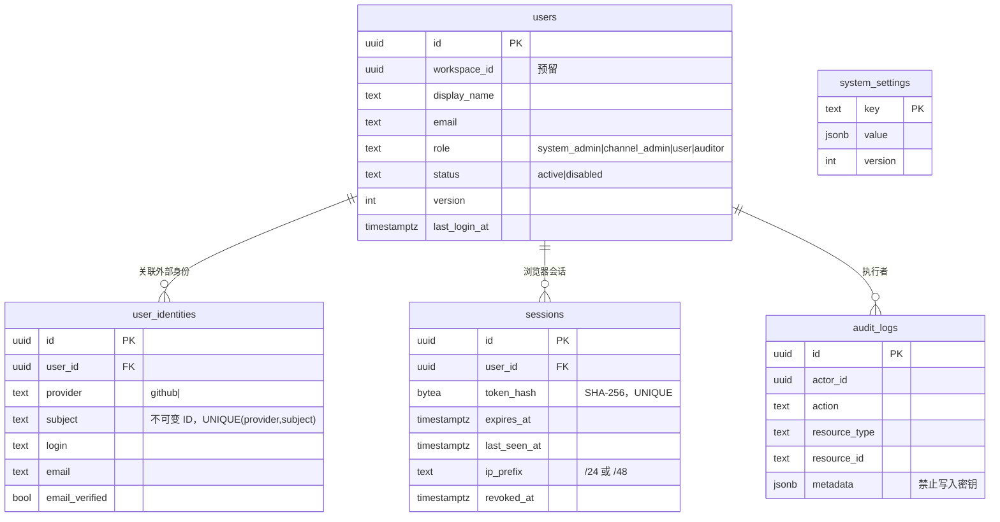
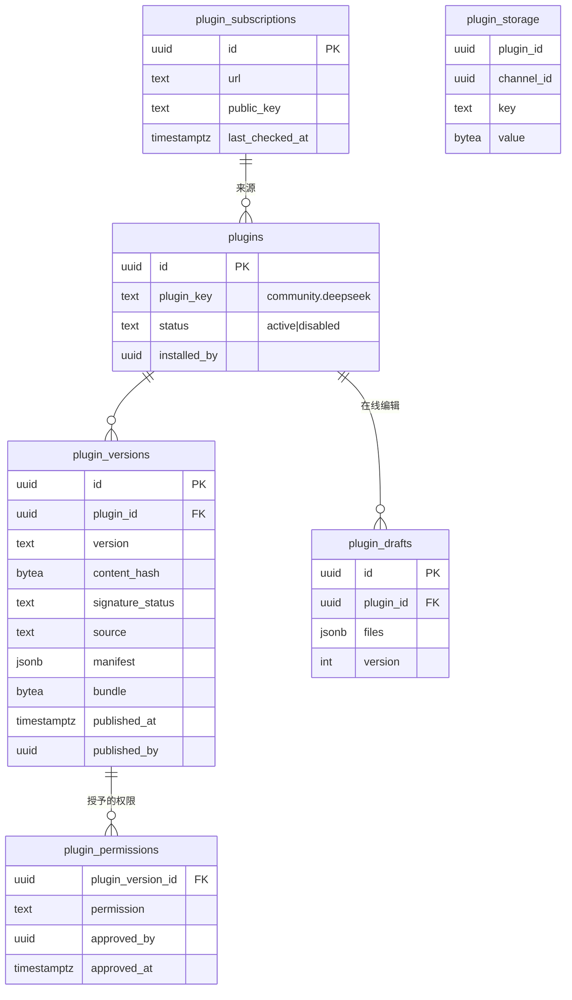
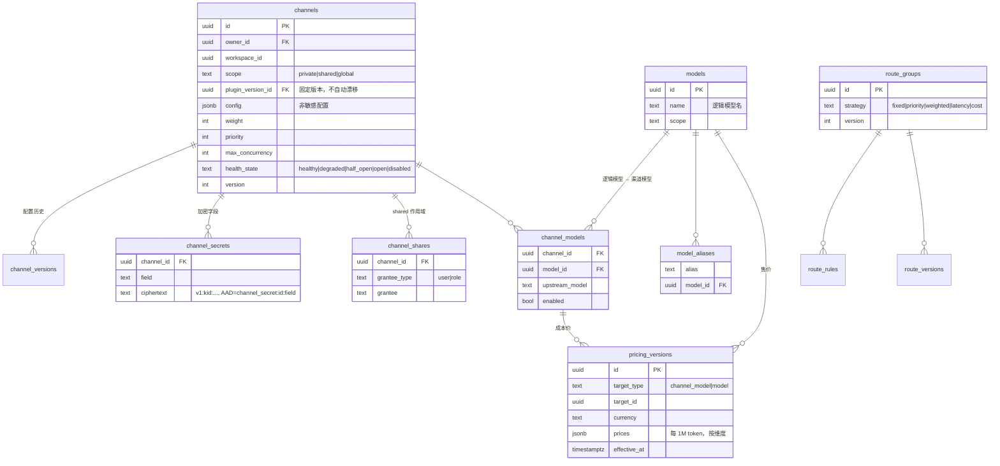
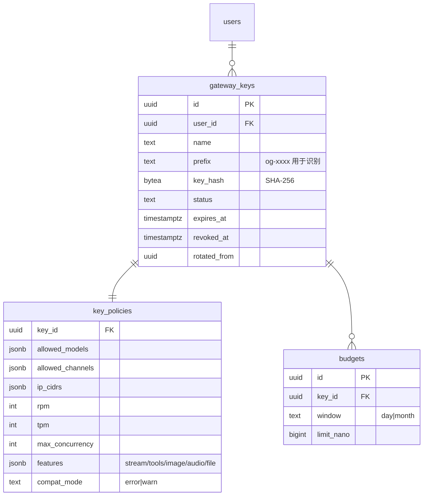
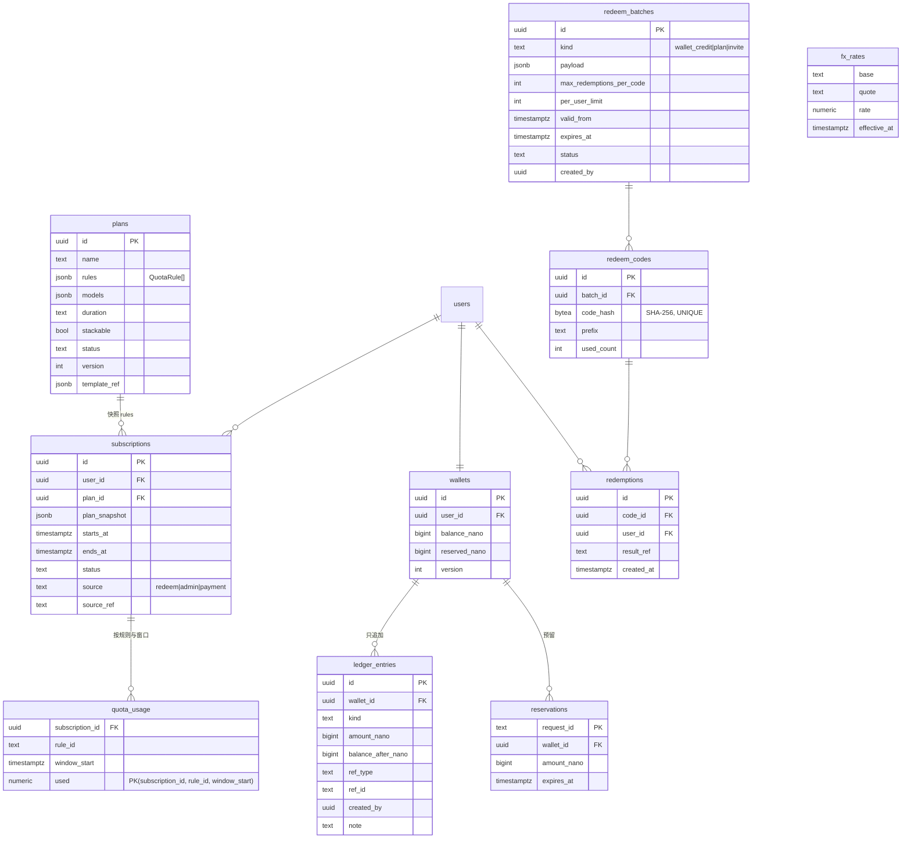
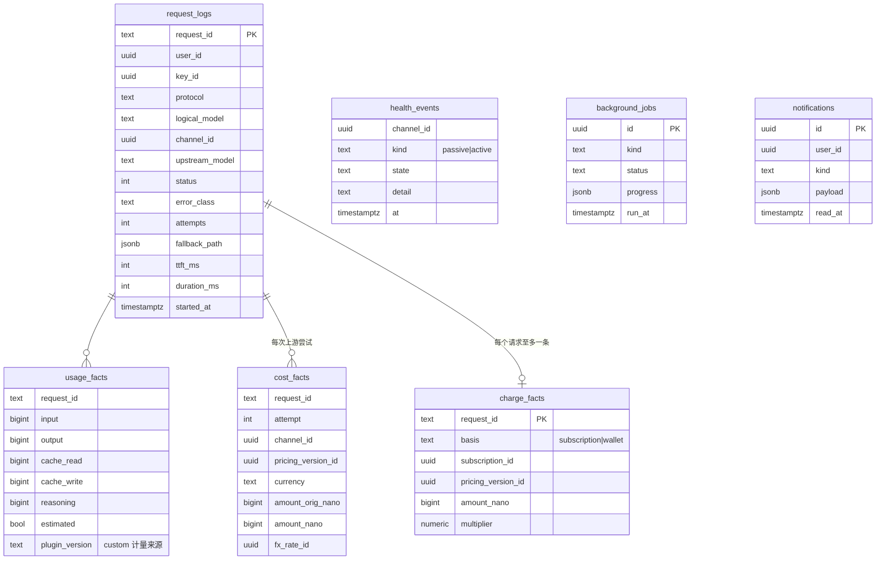

# 核心数据模型（ER 草案）

> ✅ = 已建表（`00001_identity_audit.sql`、`00002_gateway.sql`、`00003_billing.sql`、`00004_plugins.sql`）；其余为草案，在对应阶段先提交迁移和契约再实现。
> Round 2 实现与草案的差异：价格统一为一张 `prices` 表（`kind = sell | cost`）；用量与成本作为 `request_logs` 的列（不拆 `usage_facts`/`cost_facts`），
> 收入以账本中 `kind='charge'` 的唯一记录为准；`key_policies`、`budgets` 合并为 `gateway_keys.policy` jsonb（预算在 Phase 3）。
> 约定：主键 `uuid`（UUIDv7，由应用生成）；时间 `timestamptz`（UTC）；金额 `bigint`，单位为 nano（ADR-0007）；
> 可共享资源带 `workspace_id`（预留，当前为 NULL）与 `scope`；需要乐观锁的表带 `version`。

## 1. 身份与权限 ✅

角色与权限映射首期在代码中定义（ADR-0004），因此**不建** `roles`、`permissions` 表。

## 2. 插件 ✅（Round 3；与草案差异：权限审批记在 `plugin_versions.approval*` 列而非独立的 `plugin_permissions` 表；订阅源表 `plugin_subscriptions` 推迟到 Round 4；新增 `capability_results`）

## 3. 渠道、模型与路由（✅ 渠道/模型映射/价格；路由组在 Phase 3）

## 4. Gateway Key ✅

## 5. 计费、订阅与兑换（✅ 钱包/账本/预留/兑换码；套餐与订阅在 Phase 3）

## 6. 观测与事实表（✅ `request_logs` 按月分区；健康事件、任务、通知在后续阶段）

- `request_logs` 及各事实表按月分区（`PARTITION BY RANGE (started_at)`）；统计看板读取小时/日聚合表，不直接扫明细表。
- 默认**不保存** Prompt、响应正文、Authorization 头、上游 Key、完整客户端 IP。
